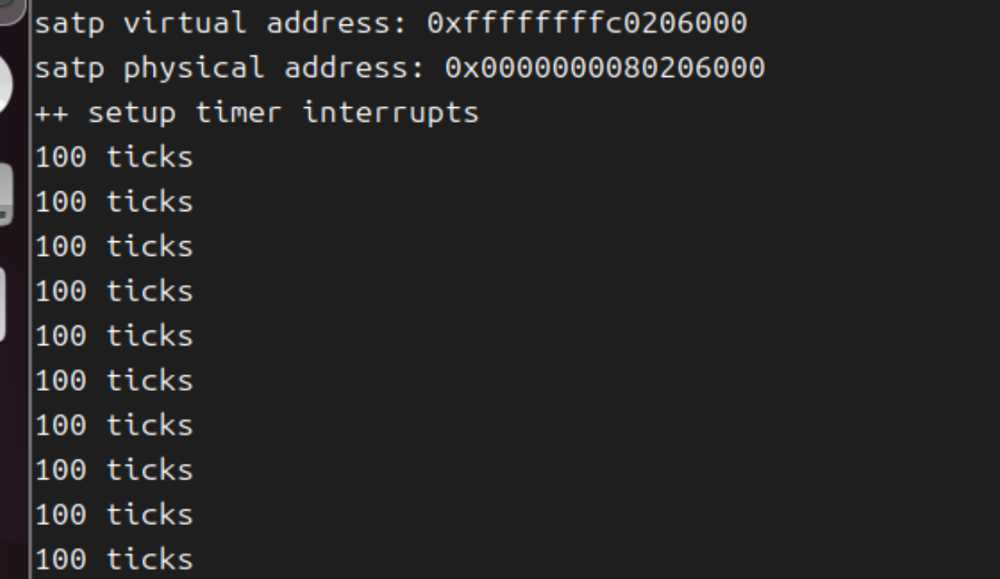
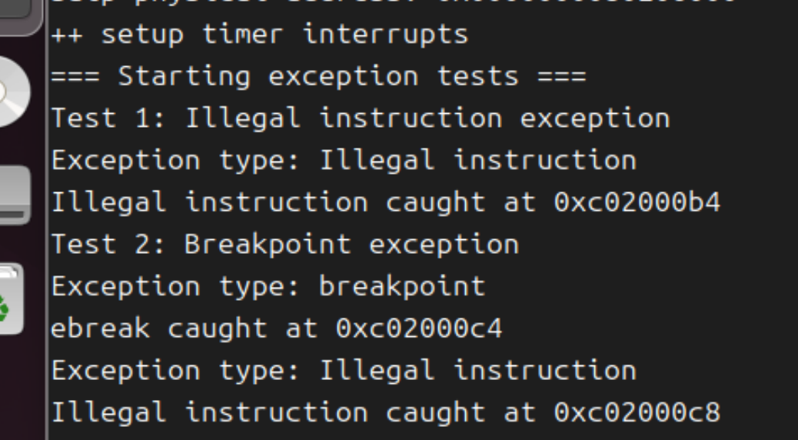

# 实验报告：中断与中断处理流程

## 实验分工

组内成员均已独立完成各练习的实验。
---


## 练习1：完善中断处理

### 1. 实验原理

中断处理是操作系统内核的核心功能之一，它负责响应来自硬件设备、软件指令或系统异常的各种事件。在RISC-V架构中，中断和异常通过统一的陷阱（trap）机制进行处理。

### 2. 实现过程

#### （1）时钟中断处理实现
1. 在中断处理函数中，调用 `clock_set_next_event()` 设置下一次时钟中断；
2. 当时钟中断时，计数器 `ticks` 递增。当 `ticks` 增加至 100 时，调用 `print_ticks()` 输出 "100 ticks"；
3. 每次输出 "100 ticks" 后，计数器 `num` 递增。判断`num`是否达到10，如果达到了，调用 `sbi.h` 中的 `sbi_shutdown()` 函数关机；

**代码：**
```c
#include<sbi.h>
case IRQ_S_TIMER:
   clock_set_next_event();//发生这次时钟中断的时候，我们要设置下一次时钟中断
   if (++ticks % TICK_NUM == 0) {
      static int num = 0;
      print_ticks();
      num++;
      if (num == 10) {
         sbi_shutdown();  // 调用关机函数
      }
   }
   break;
```
运行make qemu，输入10行"100 ticks"

### 3. 中断处理流程

定时器中断的处理始于内核初始化阶段，此时中断机制被初始化，中断向量表被设置为指向汇编代码`trapentry.S` 中的通用中断入口点 `__alltraps`，并设置了第一个时钟事件以启用时钟中断。当定时器计时结束时，会触发一个时钟中断，CPU随即自动跳转至 `__alltraps` 入口。在这里，汇编代码负责保存当前执行流的全部寄存器状态，构建一个上下文结构体，然后切换至 C 语言环境并调用 `kern/trap/trap.c` 中的中断处理函数 `trap()`，同时将保存的上下文作为参数传递。在 `trap()` 函数中，中断经过 `trap_dispatch()` 被识别为时钟类型并分发给具体的处理程序，该程序会累加时钟计数器并设置下一次时钟中断事件。处理完毕后，执行流返回 `trapentry.S`，恢复之前保存的寄存器上下文，最后通过中断返回到被中断的原程序继续执行，从而完成一次完整的定时器中断处理循环。

---

## 扩展练习 Challenge1：描述与理解中断流程

### ucore处理中断异常的流程

在ucore操作系统中，中断异常的处理始于CPU遇到中断或异常事件。当此类事件发生时，CPU会自动暂停当前执行流程，并将控制权转移到由`stvec`寄存器指向的预定义异常处理程序入口点。在系统初始化阶段，通过`idt_init()`函数已将`stvec`设置为`__alltraps`，这是所有中断异常的统一入口点，位于汇编代码中。

进入`__alltraps`后，系统首先执行关键的上下文保存操作。通过`SAVE_ALL`宏，将当前CPU的所有寄存器状态按RISC-V的ABI规范顺序压入栈中，构建完整的执行上下文快照。这一步骤确保了异常处理完成后能够精确恢复到中断前的状态。随后，通过`mov a0, sp`指令将栈指针传递给`a0`寄存器，为切换到C语言处理环境做好准备。

接下来，控制权转移到C语言编写的`trap()`函数。该函数通过分析`scause`寄存器的值来精确识别中断或异常的具体类型，并根据不同类型进行相应的分发处理。例如，时钟中断会触发调度器计时更新，而外设中断则需处理相应的I/O请求。

处理完成后，执行流返回到`__alltraps`汇编代码段，从栈中恢复之前保存的所有寄存器状态，最终通过特权指令返回到原始执行位置，使被中断的程序能够无缝继续运行，从而完成整个中断异常处理的闭环流程。

###  mov a0,sp的目的
在 `__alltraps` 中的 `mov a0,sp` 的操作是将栈指针寄存器 `sp` 的值移动到寄存器 `a0` 中。其目的是为了将当前内核栈的栈顶指针传递给接下来调用的函数`trap`，从而让 `trap` 函数能够使用该栈指针来访问保存的寄存器状态和其他上下文信息。这样可以确保异常处理函数能够正确处理和访问保存的 CPU 状态。

### SAVE_ALL中寄寄存器保存在栈中的位置的确定

`SAVE_ALL`汇编宏通过` addi sp, sp, -36 * REGBYTES`让栈顶指针向低地址空间延伸 36个寄存器的空间，可以放下一个`trapFrame`结构体，里面依次排列通用寄存器`x0`到`x31`，然后依次排列4个和中断相关的CSR。寄存器保存的位置根据`sp`的当前值向下偏移依次存储。每个寄存器对应的栈位置通过特定的偏移量来访问。

### __alltraps 中是否需要保存所有寄存器

是的，需要保存所有寄存器。因为中断可能发生在任何时刻，无法预知哪些寄存器正在使用中断。而且处理程序可能修改任何寄存器，为了保证中断返回后程序能继续正确执行，必须保留所有的寄存器信息。

## 扩展练习 Challenge2：理解上下文切换机制
#### csrw sscratch, sp 和 csrrw s0, sscratch, x0 的作用
`csrw sscratch, sp`：保存原先的栈顶指针到`sscratch`
`csrrw s0, sscratch, x0`：将`sscratch`寄存器中的当前值读取到通用寄存`s0`中。 将 `x0`（0）写入到`sscratch`寄存器中，将`sscratch`寄存器清零。

这两条指令的作用是保存当前的栈指针，并使用一个中间寄存器 sscratch作为临时存储，以确保中断处理函数能够访问到当前的栈。

#### 不还原`stval`和`scause`的原因
`stval` 和 `scause` 是异常和中断的状态寄存器，用于记录异常类型和发生的地址，存储的是异常相关的瞬时信息。保存它们是为了在中断处理过程中能够参考这些信息，但在恢复时不需要还原。因为这些信息只在当前异常处理中有意义，异常返回后会被新的异常覆盖。
**store的意义：**
1.为异常处理程序提供完整的异常上下文
2.便于调试和错误信息输出

## 扩展练习Challenge3：完善异常中断
增加了异常处理的代码，以及非法指令，来完善并测试异常中断处理。
```c
// kern/trap/trap.c
void exception_handler(struct trapframe *tf) {
   switch (tf->cause) {
      case CAUSE_ILLEGAL_INSTRUCTION:
         cprintf("Exception type: Illegal instruction\n");
         cprintf("Illegal instruction caught at 0x%08x\n", tf->epc);
         tf->epc += 4;
         break;
      case CAUSE_BREAKPOINT:
         cprintf("Exception type: breakpoint\n");
         cprintf("ebreak caught at 0x%08x\n", tf->epc);
         tf->epc += 4;
         break;
   }
}

// kern/init/init.c
   intr_enable();  // enable irq interrupt

   cprintf("=== Starting exception tests ===\n");
   cprintf("Test 1: Illegal instruction exception\n");
   asm volatile(".word 0x00000000");
   cprintf("Test 2: Breakpoint exception\n");
   asm volatile("ebreak");
   cprintf("=== Exception tests completed ===\n"); */
    
   /* do nothing */
   while (1)
```
运行make qemu，输出如下：


## 总结
### 实验中的重要知识点
* **中断处理：** 处理不同类型的中断和异常，保证系统能够正常应对外部和内部事件。
* **上下文切换：** 保存和恢复上下文是内核调度和中断处理中的关键操作。
* **异常处理机制：** 正确捕获和处理非法指令及断点，是确保系统稳定性的重要环节。

### 未涉及的重要知识点
* **进程调度：** 实验中没有深入实现进程的调度策略。
* **内存管理机制：** 虽然涉及到栈指针的使用，但没有具体实现内存分配和页面管理。